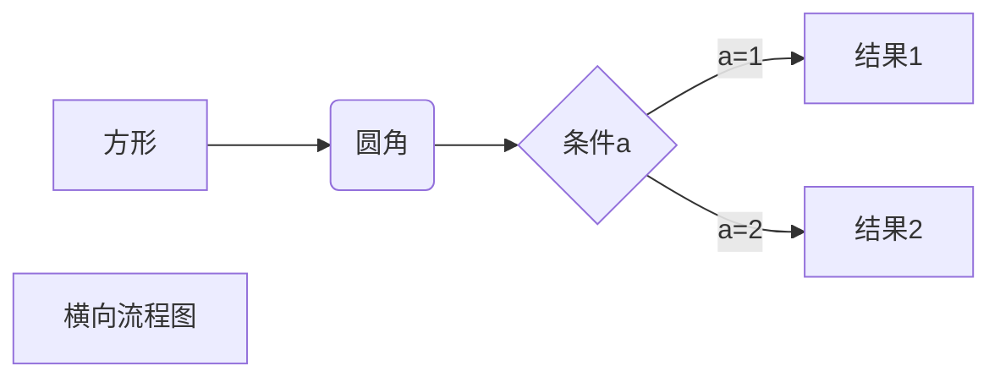
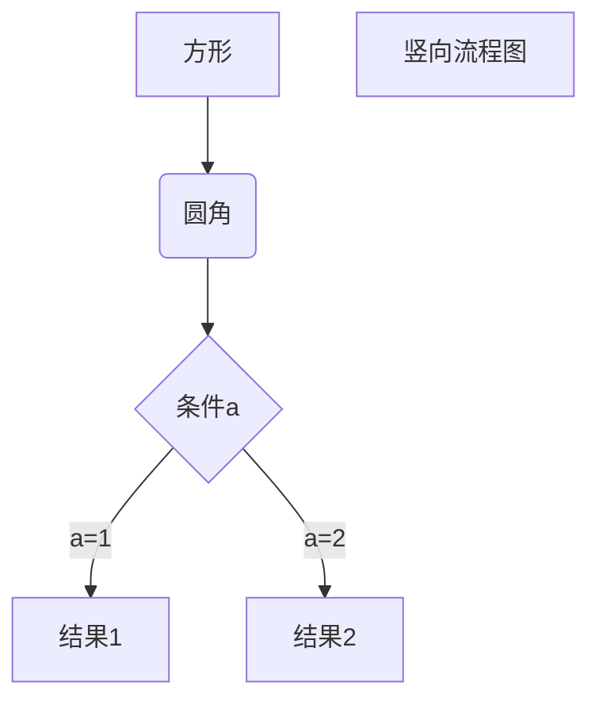
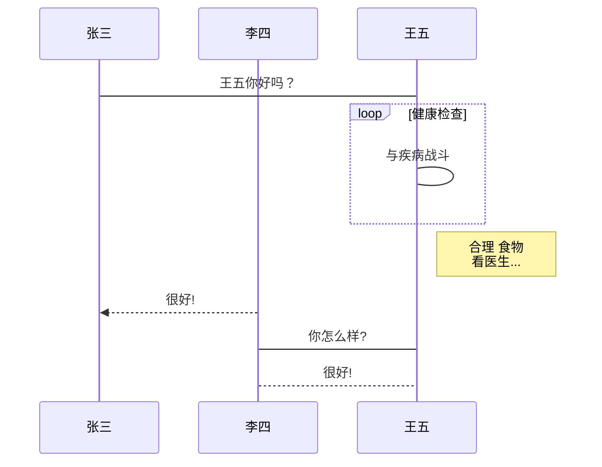
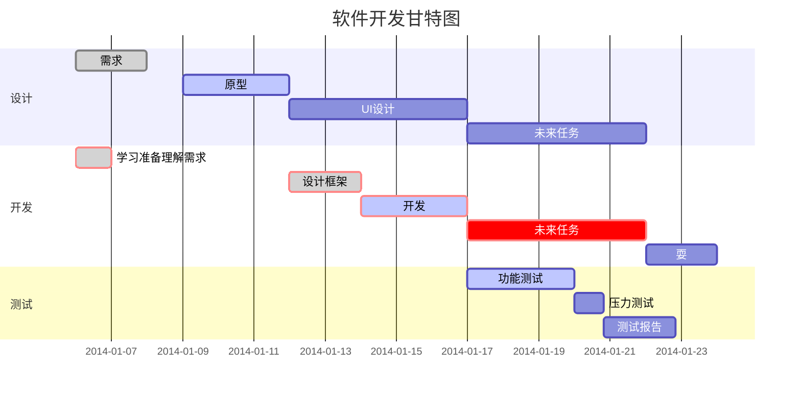

[TOC]
一级标题：标题的第一种写法
======
二级标题
-----------
注意：使用Shift+Enter
# 一级标题：标题的第二种写法
## 二级标题
### 三级标题
#### 四级标题
##### 五级标题
###### 六级标题
注意：标题一共可以有6个级别
# 段落
段落的换行是使用两个以上的空格加回车  
# 字体及脚注
*斜体*   _斜体_
**粗体** __粗体__
***粗斜体*** ___粗斜体___
~~删除线~~
<u>使用HTML的标签实现下划线</u>
创建脚注格式的效果如[^我是脚注]

[^我是脚注]:脚注内容在这里编辑
# 分割线
分割线使用三个以上符号。符号中间可以插入空格。
***
* * *
-----
- - -

# Markdown列表
### 无序列表
* 使用星号、加号或减号作为无序列表标记（注意符号后面加空格）
* 这是第二项
  + 使用加号
    - 使用减号
### 有序列表
1. 有序列表标记，数字加上点
2. 这是第二项
    - 在子列表前加四个空格进行列表嵌套
    - 这是第二项的第二个元素
# Markdown todo list
- [x] 英语第二次作文
- [ ] 程序设计原理实践
	- [ ] PA1
	- [ ] PA2
	- [x] PA3
	- [ ] PA4


# Markdown区块
> 区块引用
> 记得>符号后面紧跟空格

> 区块嵌套
> > 第一层嵌套
> >
> > > 第二层嵌套

> 区块中使用列表
> 1. 这是第一项
> 2. 这是第二项
> * 这是使用了星号的无序列表
> * 这是第二项

* 列表中使用区块 
    
    > 使用区块，记得用四个空格进行缩进
* 第二项
* 第三项

# Markdown代码
一个函数片段可以用反引号（英文输入状态下左上角）把他包起来，比如
`printf()` 函数。
代码块的输入：使用四个空格或Tab键。或使用` ``` `包围代码，并指定一种语言（也可以不指定） 

```c
#include<stdio.h>
int main()
{
	printf("hello world");
}
```

# Markdown链接
### 行内形式
一个链接：[连接名称](https://www.baidu.com)
### 参考形式
链接还可以使用变量，比如
[仝♂觩蕞♂汏同.鮏佼♂铕网.站][git]
[Myprofile][1]
有些网站要加`https://`才行
文档的结尾为变量赋

[1]:https://github.com/uuanqin
[git]:https://www.github.com
### 自动连接
直接写地址：<www.bing.com>


# Markdown图片

可以像网址那样使用变量（好像没什么区别）：[属性文本][2]

[2]: https://res3.vmallres.com/shopdc/pic/fca60437-8165-440f-bf93-4c0d39607e3d.png	"华为手机"
可以使用普通的标签指定图片的高度与宽度：


# Markdown表格
|表头|表头(使用`-`分隔表头和其他行)|
| ---- | ---- |
| 单元格 (使用`|`分隔不同的单元格)| 单元格 |
|单元格|单元格|
可以设置表格的对齐方式
|左对齐|右对齐|居中对齐|
|:----|------:|:----:|
|单元格|单元格|单元格|
|单元格|单元格|单元格|

# 高级技巧
## 支持HTML的部分标签
### 一般标签
不在Markdown涵盖范围之内的标签，都可以直接在文档里面用HTML撰写。

使用<kbd>Ctrl</kbd>+<kbd>Alt</kbd>+<kbd>A</kbd>打开QQ截屏
<b>粗体文本</b>    <i>斜体文本</i>    <big>大号字体</big>    <small>小号字体</small>    <tt>等宽文本</tt>
这是<sub>下标</sub>   这是<sup>上标</sup>    换行标签<br>换行了

下面是看起来没啥用的标签：
<em>强调的内容(好像和斜体差不多)</em>    <strong>语气更强(粗体？)</strong>    <code>代码scanf()</code>    <var>变量</var>    <cite>引用</cite>

### 折叠段落

<details><summary>Title</summary>
content
</details>
### 设置锚点
<a href='#jump'>点我跳转</a>
[点我跳转2](#jump_two)
这里给出两种方法实现锚点~~，你最喜欢哪一种呢？请在评论区留言告诉小编吧！~~
<a name='jump'>跳转到这里</a>
<span id = "jump_two">跳转到这里2</span>

## 转义符`\`
以下符号可以转义
\  `  *  _  {}  []  ()  #  +  -  .  !

## 公式

使用` $$ `包裹LaTex或TeX格式的数学公式
$$
f(x)=\int^{+\infty}_{-\infty}\frac{1}{\sqrt{2\pi}}e^{-\frac{x^2}{2}}dx=\Phi(x)
$$

# 图

### 横向流程图

### 竖向流程图

### 标准流程图
```flow
st=>start: 开始框
op=>operation: 处理框
cond=>condition: 判断框(是或否?)
sub1=>subroutine: 子流程
io=>inputoutput: 输入输出框
e=>end: 结束框
st->op->cond
cond(yes)->io->e
cond(no)->sub1(right)->op
```
### 标准流程图（横向）
```flow
st=>start: 开始框
op=>operation: 处理框
cond=>condition: 判断框(是或否?)
sub1=>subroutine: 子流程
io=>inputoutput: 输入输出框
e=>end: 结束框
st(right)->op(right)->cond
cond(yes)->io(bottom)->e
cond(no)->sub1(right)->op
```
### UML时序图
```sequence
对象A->对象B: 对象B你好吗?（请求）
Note right of 对象B: 对象B的描述
Note left of 对象A: 对象A的描述(提示)
对象B-->对象A: 我很好(响应)
对象A->对象B: 你真的好吗？
```
### UML标准时序图复杂
```sequence
Title: 标题：复杂使用
对象A->对象B: 对象B你好吗?（请求）
Note right of 对象B: 对象B的描述
Note left of 对象A: 对象A的描述(提示)
对象B-->对象A: 我很好(响应)
对象B->小三: 你好吗
小三-->>对象A: 对象B找我了
对象A->对象B: 你真的好吗？
Note over 小三,对象B: 我们是朋友
participant C
Note right of C: 没人陪我玩
```
### UML标准时序图

### 甘特图

