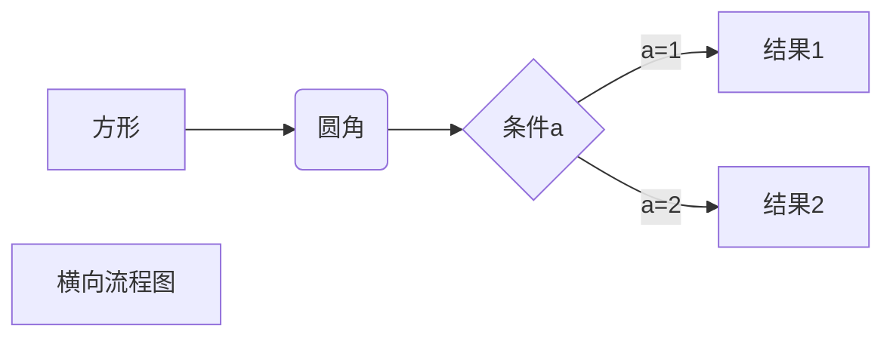
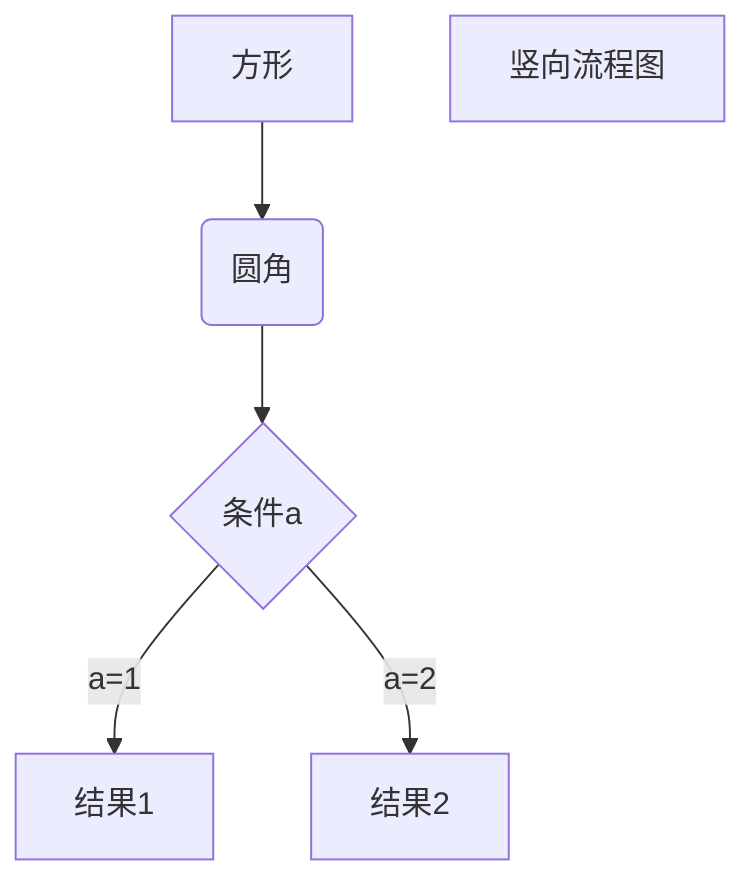
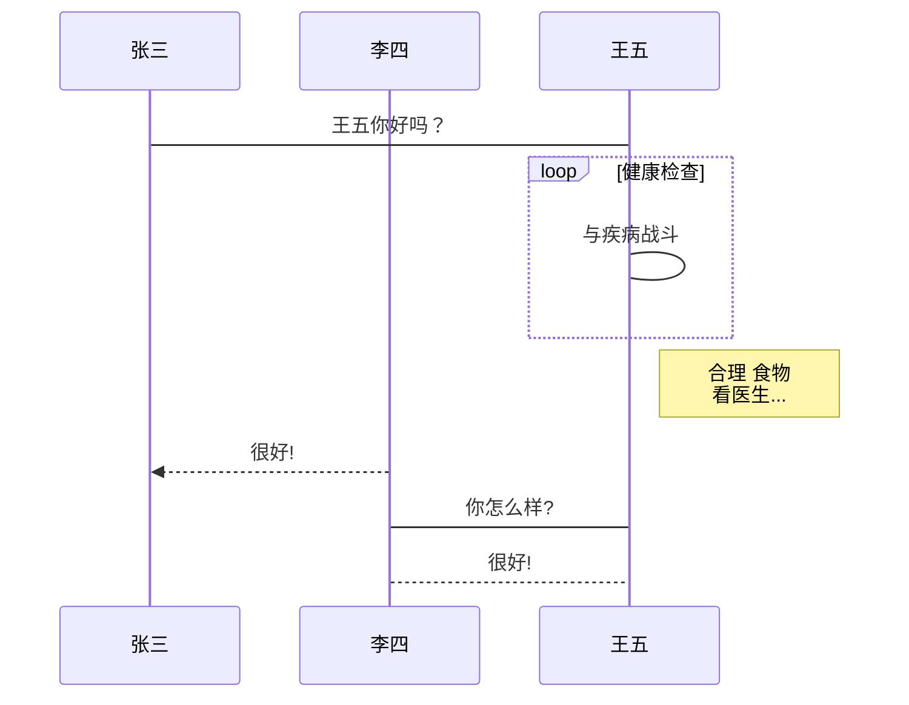
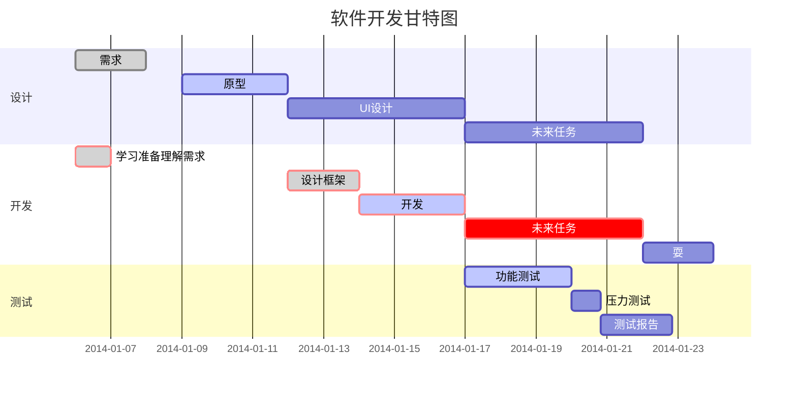

[TOC]
一级标题：标题的第一种写法
======
二级标题
-----------
注意：使用Shift+Enter
# 一级标题：标题的第二种写法
## 二级标题
### 三级标题
#### 四级标题
##### 五级标题
###### 六级标题
注意：标题一共可以有6个级别
# 段落
段落的换行是使用两个以上的空格加回车  
不要吝惜回车，在一些情况下回车会被吞掉！

# 字体及脚注
*斜体*   _斜体_
**粗体** __粗体__
***粗斜体*** ___粗斜体___
~~删除线~~
<u>使用HTML的标签实现下划线</u>

创建脚注格式的效果如[^我是脚注]

[^我是脚注]:脚注内容在这里编辑
# 分割线
分割线使用三个以上符号。符号中间可以插入空格。
***
* * *
-----
- - -

# Markdown列表
### 无序列表
* 使用星号、加号或减号作为无序列表标记（注意符号后面加空格）
* 这是第二项
  + 使用加号
    - 使用减号
### 有序列表
1. 有序列表标记，数字加上点
2. 这是第二项
    - 在子列表前加四个空格进行列表嵌套
    - 这是第二项的第二个元素
# Markdown todo list
- [x] 英语第二次作文
- [ ] 程序设计原理实践
	- [ ] PA1
	- [ ] PA2
	- [x] PA3
	- [ ] PA4


# Markdown区块
> 区块引用
> 记得>符号后面紧跟空格

> 区块嵌套
> > 第一层嵌套
> >
> > > 第二层嵌套

> 区块中使用列表
> 1. 这是第一项
> 2. 这是第二项
> * 这是使用了星号的无序列表
> * 这是第二项# 目录
[TOC]
一级标题：标题的第一种写法[^1]
======
二级标题
-----------
# 一级标题：标题的第二种写法[^2]
## 二级标题
### 三级标题
#### 四级标题
##### 五级标题
###### 六级标题
# 段落
### 换行

段落的换行是使用两个以上的空格加回车<sup>在Typora编辑器里是<kbd>Shift</kbd>+<kbd>Enter</kbd></sup>  
或者使用HTML标签<br>进行换行
不要吝惜回车，在一些情况下回车会被吞掉！

### 段首缩进

 使用特殊占位符，不同占位符所占空白是不一样大的（请在源码模式下查看）：
&ensp;或者&#8194;  表示一个半角的空格
&emsp;或者&#8195;  表示一个全角的空格
&emsp;或者&emsp;  两个全角的空格（用的比较多）
&nbsp;或者&#160;  不断行的空白格


# 字体及脚注
*斜体*   	 _斜体_
**粗体** 	__粗体__
***粗斜体***	 ___粗斜体___
~~删除线~~
我是^上标^  我是~下标~ ==文本高亮==（Typora编辑器中需要在偏好设置中的Markdown拓展语法开启上下标、文本高亮格式）
<u>使用HTML的标签实现下划线</u>
创建脚注格式的效果如[^我是脚注]

[^我是脚注]:脚注内容在这里编辑

# 特殊符号
&copy;  &trade;  &amp;  &lt;  &gt;  &pound; &yen; &euro; &reg; &plusmn; &sect;  X&sup2; Y&sup3; &frac34; &laquo; &raquo; 37.2&ordm;C

# 分割线

分割线使用三个以上符号[^3]。符号中间可以插入空格。
***
* * *
-----
- - -
___
_ _ _
<hr />

# 列表
### 无序列表
* 使用星号、加号或减号作为无序列表标记（注意符号后面加空格）
* 这是第二项
  + 使用加号
    - 使用减号
### 有序列表
1. 有序列表标记，数字加上点
2. 这是第二项
    - 在子列表前加四个空格进行列表嵌套
    - 这是第二项的第二个元素
# Todo list
- [x] 英语第二次作文
- [ ] 程序设计原理实践
	- [x] PA1
	- [ ] PA2
	- [x] PA3
	- [ ] PA4


# 区块引用
> 区块引用
> 记得>符号后面紧跟空格

> 区块嵌套
> > 第一层嵌套
> >
> > > 第二层嵌套

> 区块中使用列表
> 1. 这是第一项
> 2. 这是第二项
> * 这是使用了星号的无序列表
> * 这是第二项

* 列表中使用区块 
  
    > 使用区块，记得用四个空格进行缩进
* 第二项
* 第三项

# 代码块
一个函数片段可以用反引号（英文输入状态下左上角）把他包起来，比如
`printf()` 函数。

代码块的输入：使用四个空格或Tab键。或使用` ``` `包围代码，并指定一种语言（也可以不指定） 

```c
#include<stdio.h>
int main()
{
	printf("hello world");
}
```

# 链接
### 行内形式
一个链接：[连接名称](https://www.baidu.com)
### 参考形式
链接还可以使用变量，比如
[仝♂觩蕞♂汏同.鮏佼♂铕网.站][git]

[Myprofile][1]
有些网站要加`https://`才行

文档的结尾为变量赋值

[1]:https://github.com/uuanqin	"可加标题"
[git]:https://www.github.com
### 自动连接
直接写地址：<www.bing.com>


# 图片
### 行内形式

\未知错误20201011202347.png "未知错误")

### 参考形式
可以像网址那样使用变量：![属性文本][2]
[2]: http://www.gov.cn/govweb/xhtml/2016gov/images/public/logo_wz1.jpg "政府"
### 使用HTML标签
可以使用普通的``标签指定图片的高度与宽度：


# 表格
|表头|表头(使用`-`分隔表头和其他行)|
| ---- | ---- |
| 单元格 (使用`|`分隔不同的单元格)| 单元格 |
|单元格|单元格|
可以设置表格的对齐方式[^4]
|左对齐|右对齐|居中对齐|
|:----|------:|:----:|
|单元格|单元格|单元格|
|单元格|单元格|单元格|

可借助[在线表格生成工具](https://www.tablesgenerator.com/markdown_tables)生成表格。

# 高级技巧

## 转义符`\`
以下符号可以转义
\  `  *  _  {}  []  ()  #  +  -  .  !

## 公式
使用`$`包裹的行内公式（Typora需要在偏好设置中开启）$ M_2 \times M_1 $
使用` $$ `包裹LaTex或TeX格式的数学公式
$$
f(x)=\int^{+\infty}_{-\infty}\frac{1}{\sqrt{2\pi}}e^{-\frac{x^2}{2}}dx=\Phi(x)
$$
## 支持HTML的部分标签
[点我学习HTML5](https://www.runoob.com/html/html-tutorial.html)

### 一般标签

不在Markdown涵盖范围之内的标签，都可以直接在文档里面用HTML撰写。

使用<kbd>Ctrl</kbd>+<kbd>Alt</kbd>+<kbd>A</kbd>快速打开QQ截屏工具，这里使用了`<kbd>`标签

这是<sub>下标</sub>   这是<sup>上标</sup>    换行标签<br>换行了

下面是看起来没啥用的标签：
<em>强调的内容(好像和斜体差不多)</em>    <strong>语气更强(粗体？)</strong>    <code>代码scanf()</code>    <var>变量</var>    <cite>引用</cite>

### 字体、颜色和大小
<b>粗体文本</b>    <i>斜体文本</i>    <big>大号字体</big>    <small>小号字体</small>    <tt>等宽文本</tt>  <u>下划线</u> 

<font face="黑体">黑体</font>  <font face="微软雅黑">微软雅黑</font>  <font face="STCAIYUN">华文彩云</font>  <font face="华文行楷" >华文行楷</font>  <font face="时尚中黑" >时尚中黑</font>  （我猜你电脑里装有什么字体就能用什么字体）

<mark>黄色高亮</mark>

<font color=#00ffff size=3>#00ffff</font>   <font color=gray size=3>gray色</font>    <font color=#0099ff size=5 face="黑体">#0099ff size=5 黑体</font>
<a href='#color'>附录：颜色名列表</a>

### 折叠段落

<details><summary>Title</summary>
content
</details>

### 设置锚点

<a href='#jump'>点我跳转</a>

[点我跳转2](#jump_two)

这里给出两种方法实现锚点~~，你最喜欢哪一种呢？请在评论区留言告诉小编吧！~~

<a name='jump'>跳转到这里</a>

<span id = "jump_two">跳转到这里2</span>

### 表格
<table><tbody>
    <tr>
        <th rowspan="3">我占了三行</th>
        <th><font color="Green">第一列</font></th>
        <th>第二列</th>
        <th>第三列</th>
    </tr>
    <tr>
        <td bgcolor="Tomato">第一列</td>
        <td>第二列</td>
        <td>第三列</td>
    </tr>
    <tr>
        <td>第一列</td>
        <td>第二列</td>
        <td>第三列</td>
    </tr>
</table>  

## 图
### 流程图

#### 横向流程图


#### 竖向流程图

#### 标准流程图
```flow
st=>start: 开始框
op=>operation: 处理框
cond=>condition: 判断框(是或否?)
sub1=>subroutine: 子流程
io=>inputoutput: 输入输出框
e=>end: 结束框
st->op->cond
cond(yes)->io->e
cond(no)->sub1(right)->op
```
#### 标准流程图（横向）
```flow
st=>start: 开始框
op=>operation: 处理框
cond=>condition: 判断框(是或否?)
sub1=>subroutine: 子流程
io=>inputoutput: 输入输出框
e=>end: 结束框
st(right)->op(right)->cond
cond(yes)->io(bottom)->e
cond(no)->sub1(right)->op
```
### 时序图

#### UML时序图

```sequence
对象A->对象B: 对象B你好吗?（请求）
Note right of 对象B: 对象B的描述
Note left of 对象A: 对象A的描述(提示)
对象B-->对象A: 我很好(响应)
对象A->对象B: 你真的好吗？
```
#### UML标准时序图复杂
```sequence
Title: 标题：复杂使用
对象A->对象B: 对象B你好吗?（请求）
Note right of 对象B: 对象B的描述
Note left of 对象A: 对象A的描述(提示)
对象B-->对象A: 我很好(响应)
对象B->小三: 你好吗
小三-->>对象A: 对象B找我了
对象A->对象B: 你真的好吗？
Note over 小三,对象B: 我们是朋友
participant C
Note right of C: 没人陪我玩
```
#### UML标准时序图

### 甘特图



# 附录
#### 颜色名列表

 <details><summary><a name = "color">颜色名列表</a></summary><div class="table-box"><table><tbody><tr><th>颜色名</th><th>十六进制颜色值</th><th>颜色</th></tr><tr><td><font color="AliceBlue">AliceBlue</font></td><td><font color="#F0F8FF">#F0F8FF</font></td><td bgcolor="#F0F8FF">rgb(240, 248, 255)</td></tr><tr><td><font color="AntiqueWhite">AntiqueWhite</font></td><td><font color="#FAEBD7">#FAEBD7</font></td><td bgcolor="#FAEBD7">rgb(250, 235, 215)</td></tr><tr><td><font color="Aqua">Aqua</font></td><td><font color="#00FFFF">#00FFFF</font></td><td bgcolor="#00FFFF">rgb(0, 255, 255)</td></tr><tr><td><font color="Aquamarine">Aquamarine</font></td><td><font color="#7FFFD4">#7FFFD4</font></td><td bgcolor="#7FFFD4">rgb(127, 255, 212)</td></tr><tr><td><font color="Azure">Azure</font></td><td><font color="#F0FFFF">#F0FFFF</font></td><td bgcolor="#F0FFFF">rgb(240, 255, 255)</td></tr><tr><td><font color="Beige">Beige</font></td><td><font color="#F5F5DC">#F5F5DC</font></td><td bgcolor="#F5F5DC">rgb(245, 245, 220)</td></tr><tr><td><font color="Bisque">Bisque</font></td><td><font color="#FFE4C4">#FFE4C4</font></td><td bgcolor="#FFE4C4">rgb(255, 228, 196)</td></tr><tr><td><font color="Black">Black</font></td><td><font color="#000000">#000000</font></td><td bgcolor="#000000">rgb(0, 0, 0)</td></tr><tr><td><font color="BlanchedAlmond">BlanchedAlmond</font></td><td><font color="#FFEBCD">#FFEBCD</font></td><td bgcolor="#FFEBCD">rgb(255, 235, 205)</td></tr><tr><td><font color="Blue">Blue</font></td><td><font color="#0000FF">#0000FF</font></td><td bgcolor="#0000FF">rgb(0, 0, 255)</td></tr><tr><td><font color="BlueViolet">BlueViolet</font></td><td><font color="#8A2BE2">#8A2BE2</font></td><td bgcolor="#8A2BE2">rgb(138, 43, 226)</td></tr><tr><td><font color="Brown">Brown</font></td><td><font color="#A52A2A">#A52A2A</font></td><td bgcolor="#A52A2A">rgb(165, 42, 42)</td></tr><tr><td><font color="BurlyWood">BurlyWood</font></td><td><font color="#DEB887">#DEB887</font></td><td bgcolor="#DEB887">rgb(222, 184, 135)</td></tr><tr><td><font color="CadetBlue">CadetBlue</font></td><td><font color="#5F9EA0">#5F9EA0</font></td><td bgcolor="#5F9EA0">rgb(95, 158, 160)</td></tr><tr><td><font color="Chartreuse">Chartreuse</font></td><td><font color="#7FFF00">#7FFF00</font></td><td bgcolor="#7FFF00">rgb(127, 255, 0)</td></tr><tr><td><font color="Chocolate">Chocolate</font></td><td><font color="#D2691E">#D2691E</font></td><td bgcolor="#D2691E">rgb(210, 105, 30)</td></tr><tr><td><font color="Coral">Coral</font></td><td><font color="#FF7F50">#FF7F50</font></td><td bgcolor="#FF7F50">rgb(255, 127, 80)</td></tr><tr><td><font color="CornflowerBlue">CornflowerBlue</font></td><td><font color="#6495ED">#6495ED</font></td><td bgcolor="#6495ED">rgb(100, 149, 237)</td></tr><tr><td><font color="Cornsilk">Cornsilk</font></td><td><font color="#FFF8DC">#FFF8DC</font></td><td bgcolor="#FFF8DC">rgb(255, 248, 220)</td></tr><tr><td><font color="Crimson">Crimson</font></td><td><font color="#DC143C">#DC143C</font></td><td bgcolor="#DC143C">rgb(220, 20, 60)</td></tr><tr><td><font color="Cyan">Cyan</font></td><td><font color="#00FFFF">#00FFFF</font></td><td bgcolor="#00FFFF">rgb(0, 255, 255)</td></tr><tr><td><font color="DarkBlue">DarkBlue</font></td><td><font color="#00008B">#00008B</font></td><td bgcolor="#00008B">rgb(0, 0, 139)</td></tr><tr><td><font color="DarkCyan">DarkCyan</font></td><td><font color="#008B8B">#008B8B</font></td><td bgcolor="#008B8B">rgb(0, 139, 139)</td></tr><tr><td><font color="DarkGoldenRod">DarkGoldenRod</font></td><td><font color="#B8860B">#B8860B</font></td><td bgcolor="#B8860B">rgb(184, 134, 11)</td></tr><tr><td><font color="DarkGray">DarkGray</font></td><td><font color="#A9A9A9">#A9A9A9</font></td><td bgcolor="#A9A9A9">rgb(169, 169, 169)</td></tr><tr><td><font color="DarkGreen">DarkGreen</font></td><td><font color="#006400">#006400</font></td><td bgcolor="#006400">rgb(0, 100, 0)</td></tr><tr><td><font color="DarkKhaki">DarkKhaki</font></td><td><font color="#BDB76B">#BDB76B</font></td><td bgcolor="#BDB76B">rgb(189, 183, 107)</td></tr><tr><td><font color="DarkMagenta">DarkMagenta</font></td><td><font color="#8B008B">#8B008B</font></td><td bgcolor="#8B008B">rgb(139, 0, 139)</td></tr><tr><td><font color="DarkOliveGreen">DarkOliveGreen</font></td><td><font color="#556B2F">#556B2F</font></td><td bgcolor="#556B2F">rgb(85, 107, 47)</td></tr><tr><td><font color="Darkorange">Darkorange</font></td><td><font color="#FF8C00">#FF8C00</font></td><td bgcolor="#FF8C00">rgb(255, 140, 0)</td></tr><tr><td><font color="DarkOrchid">DarkOrchid</font></td><td><font color="#9932CC">#9932CC</font></td><td bgcolor="#9932CC">rgb(153, 50, 204)</td></tr><tr><td><font color="DarkRed">DarkRed</font></td><td><font color="#8B0000">#8B0000</font></td><td bgcolor="#8B0000">rgb(139, 0, 0)</td></tr><tr><td><font color="DarkSalmon">DarkSalmon</font></td><td><font color="#E9967A">#E9967A</font></td><td bgcolor="#E9967A">rgb(233, 150, 122)</td></tr><tr><td><font color="DarkSeaGreen">DarkSeaGreen</font></td><td><font color="#8FBC8F">#8FBC8F</font></td><td bgcolor="#8FBC8F">rgb(143, 188, 143)</td></tr><tr><td><font color="DarkSlateBlue">DarkSlateBlue</font></td><td><font color="#483D8B">#483D8B</font></td><td bgcolor="#483D8B">rgb(72, 61, 139)</td></tr><tr><td><font color="DarkSlateGray">DarkSlateGray</font></td><td><font color="#2F4F4F">#2F4F4F</font></td><td bgcolor="#2F4F4F">rgb(47, 79, 79)</td></tr><tr><td><font color="DarkTurquoise">DarkTurquoise</font></td><td><font color="#00CED1">#00CED1</font></td><td bgcolor="#00CED1">rgb(0, 206, 209)</td></tr><tr><td><font color="DarkViolet">DarkViolet</font></td><td><font color="#9400D3">#9400D3</font></td><td bgcolor="#9400D3">rgb(148, 0, 211)</td></tr><tr><td><font color="DeepPink">DeepPink</font></td><td><font color="#FF1493">#FF1493</font></td><td bgcolor="#FF1493">rgb(255, 20, 147)</td></tr><tr><td><font color="DeepSkyBlue">DeepSkyBlue</font></td><td><font color="#00BFFF">#00BFFF</font></td><td bgcolor="#00BFFF">rgb(0, 191, 255)</td></tr><tr><td><font color="DimGray">DimGray</font></td><td><font color="#696969">#696969</font></td><td bgcolor="#696969">rgb(105, 105, 105)</td></tr><tr><td><font color="DodgerBlue">DodgerBlue</font></td><td><font color="#1E90FF">#1E90FF</font></td><td bgcolor="#1E90FF">rgb(30, 144, 255)</td></tr><tr><td><font color="Feldspar">Feldspar</font></td><td><font color="#D19275">#D19275</font></td><td bgcolor="#D19275">rgb(209, 146, 117)</td></tr><tr><td><font color="FireBrick">FireBrick</font></td><td><font color="#B22222">#B22222</font></td><td bgcolor="#B22222">rgb(178, 34, 34)</td></tr><tr><td><font color="FloralWhite">FloralWhite</font></td><td><font color="#FFFAF0">#FFFAF0</font></td><td bgcolor="#FFFAF0">rgb(255, 250, 240)</td></tr><tr><td><font color="ForestGreen">ForestGreen</font></td><td><font color="#228B22">#228B22</font></td><td bgcolor="#228B22">rgb(34, 139, 34)</td></tr><tr><td><font color="Fuchsia">Fuchsia</font></td><td><font color="#FF00FF">#FF00FF</font></td><td bgcolor="#FF00FF">rgb(255, 0, 255)</td></tr><tr><td><font color="Gainsboro">Gainsboro</font></td><td><font color="#DCDCDC">#DCDCDC</font></td><td bgcolor="#DCDCDC">rgb(220, 220, 220)</td></tr><tr><td><font color="GhostWhite">GhostWhite</font></td><td><font color="#F8F8FF">#F8F8FF</font></td><td bgcolor="#F8F8FF">rgb(248, 248, 255)</td></tr><tr><td><font color="Gold">Gold</font></td><td><font color="#FFD700">#FFD700</font></td><td bgcolor="#FFD700">rgb(255, 215, 0)</td></tr><tr><td><font color="GoldenRod">GoldenRod</font></td><td><font color="#DAA520">#DAA520</font></td><td bgcolor="#DAA520">rgb(218, 165, 32)</td></tr><tr><td><font color="Gray">Gray</font></td><td><font color="#808080">#808080</font></td><td bgcolor="#808080">rgb(128, 128, 128)</td></tr><tr><td><font color="Green">Green</font></td><td><font color="#008000">#008000</font></td><td bgcolor="#008000">rgb(0, 128, 0)</td></tr><tr><td><font color="GreenYellow">GreenYellow</font></td><td><font color="#ADFF2F">#ADFF2F</font></td><td bgcolor="#ADFF2F">rgb(173, 255, 47)</td></tr><tr><td><font color="HoneyDew">HoneyDew</font></td><td><font color="#F0FFF0">#F0FFF0</font></td><td bgcolor="#F0FFF0">rgb(240, 255, 240)</td></tr><tr><td><font color="HotPink">HotPink</font></td><td><font color="#FF69B4">#FF69B4</font></td><td bgcolor="#FF69B4">rgb(255, 105, 180)</td></tr><tr><td><font color="IndianRed">IndianRed</font></td><td><font color="#CD5C5C">#CD5C5C</font></td><td bgcolor="#CD5C5C">rgb(205, 92, 92)</td></tr><tr><td><font color="Indigo">Indigo</font></td><td><font color="#4B0082">#4B0082</font></td><td bgcolor="#4B0082">rgb(75, 0, 130)</td></tr><tr><td><font color="Ivory">Ivory</font></td><td><font color="#FFFFF0">#FFFFF0</font></td><td bgcolor="#FFFFF0">rgb(255, 255, 240)</td></tr><tr><td><font color="Khaki">Khaki</font></td><td><font color="#F0E68C">#F0E68C</font></td><td bgcolor="#F0E68C">rgb(240, 230, 140)</td></tr><tr><td><font color="Lavender">Lavender</font></td><td><font color="#E6E6FA">#E6E6FA</font></td><td bgcolor="#E6E6FA">rgb(230, 230, 250)</td></tr><tr><td><font color="LavenderBlush">LavenderBlush</font></td><td><font color="#FFF0F5">#FFF0F5</font></td><td bgcolor="#FFF0F5">rgb(255, 240, 245)</td></tr><tr><td><font color="LawnGreen">LawnGreen</font></td><td><font color="#7CFC00">#7CFC00</font></td><td bgcolor="#7CFC00">rgb(124, 252, 0)</td></tr><tr><td><font color="LemonChiffon">LemonChiffon</font></td><td><font color="#FFFACD">#FFFACD</font></td><td bgcolor="#FFFACD">rgb(255, 250, 205)</td></tr><tr><td><font color="LightBlue">LightBlue</font></td><td><font color="#ADD8E6">#ADD8E6</font></td><td bgcolor="#ADD8E6">rgb(173, 216, 230)</td></tr><tr><td><font color="LightCoral">LightCoral</font></td><td><font color="#F08080">#F08080</font></td><td bgcolor="#F08080">rgb(240, 128, 128)</td></tr><tr><td><font color="LightCyan">LightCyan</font></td><td><font color="#E0FFFF">#E0FFFF</font></td><td bgcolor="#E0FFFF">rgb(224, 255, 255)</td></tr><tr><td><font color="LightGoldenRodYellow">LightGoldenRodYellow</font></td><td><font color="#FAFAD2">#FAFAD2</font></td><td bgcolor="#FAFAD2">rgb(250, 250, 210)</td></tr><tr><td><font color="LightGrey">LightGrey</font></td><td><font color="#D3D3D3">#D3D3D3</font></td><td bgcolor="#D3D3D3">rgb(211, 211, 211)</td></tr><tr><td><font color="LightGreen">LightGreen</font></td><td><font color="#90EE90">#90EE90</font></td><td bgcolor="#90EE90">rgb(144, 238, 144)</td></tr><tr><td><font color="LightPink">LightPink</font></td><td><font color="#FFB6C1">#FFB6C1</font></td><td bgcolor="#FFB6C1">rgb(255, 182, 193)</td></tr><tr><td><font color="LightSalmon">LightSalmon</font></td><td><font color="#FFA07A">#FFA07A</font></td><td bgcolor="#FFA07A">rgb(255, 160, 122)</td></tr><tr><td><font color="LightSeaGreen">LightSeaGreen</font></td><td><font color="#20B2AA">#20B2AA</font></td><td bgcolor="#20B2AA">rgb(32, 178, 170)</td></tr><tr><td><font color="LightSkyBlue">LightSkyBlue</font></td><td><font color="#87CEFA">#87CEFA</font></td><td bgcolor="#87CEFA">rgb(135, 206, 250)</td></tr><tr><td><font color="LightSlateBlue">LightSlateBlue</font></td><td><font color="#8470FF">#8470FF</font></td><td bgcolor="#8470FF">rgb(132, 112, 255)</td></tr><tr><td><font color="LightSlateGray">LightSlateGray</font></td><td><font color="#778899">#778899</font></td><td bgcolor="#778899">rgb(119, 136, 153)</td></tr><tr><td><font color="LightSteelBlue">LightSteelBlue</font></td><td><font color="#B0C4DE">#B0C4DE</font></td><td bgcolor="#B0C4DE">rgb(176, 196, 222)</td></tr><tr><td><font color="LightYellow">LightYellow</font></td><td><font color="#FFFFE0">#FFFFE0</font></td><td bgcolor="#FFFFE0">rgb(255, 255, 224)</td></tr><tr><td><font color="Lime">Lime</font></td><td><font color="#00FF00">#00FF00</font></td><td bgcolor="#00FF00">rgb(0, 255, 0)</td></tr><tr><td><font color="LimeGreen">LimeGreen</font></td><td><font color="#32CD32">#32CD32</font></td><td bgcolor="#32CD32">rgb(50, 205, 50)</td></tr><tr><td><font color="Linen">Linen</font></td><td><font color="#FAF0E6">#FAF0E6</font></td><td bgcolor="#FAF0E6">rgb(250, 240, 230)</td></tr><tr><td><font color="Magenta">Magenta</font></td><td><font color="#FF00FF">#FF00FF</font></td><td bgcolor="#FF00FF">rgb(255, 0, 255)</td></tr><tr><td><font color="Maroon">Maroon</font></td><td><font color="#800000">#800000</font></td><td bgcolor="#800000">rgb(128, 0, 0)</td></tr><tr><td><font color="MediumAquaMarine">MediumAquaMarine</font></td><td><font color="#66CDAA">#66CDAA</font></td><td bgcolor="#66CDAA">rgb(102, 205, 170)</td></tr><tr><td><font color="MediumBlue">MediumBlue</font></td><td><font color="#0000CD">#0000CD</font></td><td bgcolor="#0000CD">rgb(0, 0, 205)</td></tr><tr><td><font color="MediumOrchid">MediumOrchid</font></td><td><font color="#BA55D3">#BA55D3</font></td><td bgcolor="#BA55D3">rgb(186, 85, 211)</td></tr><tr><td><font color="MediumPurple">MediumPurple</font></td><td><font color="#9370D8">#9370D8</font></td><td bgcolor="#9370D8">rgb(147, 112, 216)</td></tr><tr><td><font color="MediumSeaGreen">MediumSeaGreen</font></td><td><font color="#3CB371">#3CB371</font></td><td bgcolor="#3CB371">rgb(60, 179, 113)</td></tr><tr><td><font color="MediumSlateBlue">MediumSlateBlue</font></td><td><font color="#7B68EE">#7B68EE</font></td><td bgcolor="#7B68EE">rgb(123, 104, 238)</td></tr><tr><td><font color="MediumSpringGreen">MediumSpringGreen</font></td><td><font color="#00FA9A">#00FA9A</font></td><td bgcolor="#00FA9A">rgb(0, 250, 154)</td></tr><tr><td><font color="MediumTurquoise">MediumTurquoise</font></td><td><font color="#48D1CC">#48D1CC</font></td><td bgcolor="#48D1CC">rgb(72, 209, 204)</td></tr><tr><td><font color="MediumVioletRed">MediumVioletRed</font></td><td><font color="#C71585">#C71585</font></td><td bgcolor="#C71585">rgb(199, 21, 133)</td></tr><tr><td><font color="MidnightBlue">MidnightBlue</font></td><td><font color="#191970">#191970</font></td><td bgcolor="#191970">rgb(25, 25, 112)</td></tr><tr><td><font color="MintCream">MintCream</font></td><td><font color="#F5FFFA">#F5FFFA</font></td><td bgcolor="#F5FFFA">rgb(245, 255, 250)</td></tr><tr><td><font color="MistyRose">MistyRose</font></td><td><font color="#FFE4E1">#FFE4E1</font></td><td bgcolor="#FFE4E1">rgb(255, 228, 225)</td></tr><tr><td><font color="Moccasin">Moccasin</font></td><td><font color="#FFE4B5">#FFE4B5</font></td><td bgcolor="#FFE4B5">rgb(255, 228, 181)</td></tr><tr><td><font color="NavajoWhite">NavajoWhite</font></td><td><font color="#FFDEAD">#FFDEAD</font></td><td bgcolor="#FFDEAD">rgb(255, 222, 173)</td></tr><tr><td><font color="Navy">Navy</font></td><td><font color="#000080">#000080</font></td><td bgcolor="#000080">rgb(0, 0, 128)</td></tr><tr><td><font color="OldLace">OldLace</font></td><td><font color="#FDF5E6">#FDF5E6</font></td><td bgcolor="#FDF5E6">rgb(253, 245, 230)</td></tr><tr><td><font color="Olive">Olive</font></td><td><font color="#808000">#808000</font></td><td bgcolor="#808000">rgb(128, 128, 0)</td></tr><tr><td><font color="OliveDrab">OliveDrab</font></td><td><font color="#6B8E23">#6B8E23</font></td><td bgcolor="#6B8E23">rgb(107, 142, 35)</td></tr><tr><td><font color="Orange">Orange</font></td><td><font color="#FFA500">#FFA500</font></td><td bgcolor="#FFA500">rgb(255, 165, 0)</td></tr><tr><td><font color="OrangeRed">OrangeRed</font></td><td><font color="#FF4500">#FF4500</font></td><td bgcolor="#FF4500">rgb(255, 69, 0)</td></tr><tr><td><font color="Orchid">Orchid</font></td><td><font color="#DA70D6">#DA70D6</font></td><td bgcolor="#DA70D6">rgb(218, 112, 214)</td></tr><tr><td><font color="PaleGoldenRod">PaleGoldenRod</font></td><td><font color="#EEE8AA">#EEE8AA</font></td><td bgcolor="#EEE8AA">rgb(238, 232, 170)</td></tr><tr><td><font color="PaleGreen">PaleGreen</font></td><td><font color="#98FB98">#98FB98</font></td><td bgcolor="#98FB98">rgb(152, 251, 152)</td></tr><tr><td><font color="PaleTurquoise">PaleTurquoise</font></td><td><font color="#AFEEEE">#AFEEEE</font></td><td bgcolor="#AFEEEE">rgb(175, 238, 238)</td></tr><tr><td><font color="PaleVioletRed">PaleVioletRed</font></td><td><font color="#D87093">#D87093</font></td><td bgcolor="#D87093">rgb(216, 112, 147)</td></tr><tr><td><font color="PapayaWhip">PapayaWhip</font></td><td><font color="#FFEFD5">#FFEFD5</font></td><td bgcolor="#FFEFD5">rgb(255, 239, 213)</td></tr><tr><td><font color="PeachPuff">PeachPuff</font></td><td><font color="#FFDAB9">#FFDAB9</font></td><td bgcolor="#FFDAB9">rgb(255, 218, 185)</td></tr><tr><td><font color="Peru">Peru</font></td><td><font color="#CD853F">#CD853F</font></td><td bgcolor="#CD853F">rgb(205, 133, 63)</td></tr><tr><td><font color="Pink">Pink</font></td><td><font color="#FFC0CB">#FFC0CB</font></td><td bgcolor="#FFC0CB">rgb(255, 192, 203)</td></tr><tr><td><font color="Plum">Plum</font></td><td><font color="#DDA0DD">#DDA0DD</font></td><td bgcolor="#DDA0DD">rgb(221, 160, 221)</td></tr><tr><td><font color="PowderBlue">PowderBlue</font></td><td><font color="#B0E0E6">#B0E0E6</font></td><td bgcolor="#B0E0E6">rgb(176, 224, 230)</td></tr><tr><td><font color="Purple">Purple</font></td><td><font color="#800080">#800080</font></td><td bgcolor="#800080">rgb(128, 0, 128)</td></tr><tr><td><font color="Red">Red</font></td><td><font color="#FF0000">#FF0000</font></td><td bgcolor="#FF0000">rgb(255, 0, 0)</td></tr><tr><td><font color="RosyBrown">RosyBrown</font></td><td><font color="#BC8F8F">#BC8F8F</font></td><td bgcolor="#BC8F8F">rgb(188, 143, 143)</td></tr><tr><td><font color="RoyalBlue">RoyalBlue</font></td><td><font color="#4169E1">#4169E1</font></td><td bgcolor="#4169E1">rgb(65, 105, 225)</td></tr><tr><td><font color="SaddleBrown">SaddleBrown</font></td><td><font color="#8B4513">#8B4513</font></td><td bgcolor="#8B4513">rgb(139, 69, 19)</td></tr><tr><td><font color="Salmon">Salmon</font></td><td><font color="#FA8072">#FA8072</font></td><td bgcolor="#FA8072">rgb(250, 128, 114)</td></tr><tr><td><font color="SandyBrown">SandyBrown</font></td><td><font color="#F4A460">#F4A460</font></td><td bgcolor="#F4A460">rgb(244, 164, 96)</td></tr><tr><td><font color="SeaGreen">SeaGreen</font></td><td><font color="#2E8B57">#2E8B57</font></td><td bgcolor="#2E8B57">rgb(46, 139, 87)</td></tr><tr><td><font color="SeaShell">SeaShell</font></td><td><font color="#FFF5EE">#FFF5EE</font></td><td bgcolor="#FFF5EE">rgb(255, 245, 238)</td></tr><tr><td><font color="Sienna">Sienna</font></td><td><font color="#A0522D">#A0522D</font></td><td bgcolor="#A0522D">rgb(160, 82, 45)</td></tr><tr><td><font color="Silver">Silver</font></td><td><font color="#C0C0C0">#C0C0C0</font></td><td bgcolor="#C0C0C0">rgb(192, 192, 192)</td></tr><tr><td><font color="SkyBlue">SkyBlue</font></td><td><font color="#87CEEB">#87CEEB</font></td><td bgcolor="#87CEEB">rgb(135, 206, 235)</td></tr><tr><td><font color="SlateBlue">SlateBlue</font></td><td><font color="#6A5ACD">#6A5ACD</font></td><td bgcolor="#6A5ACD">rgb(106, 90, 205)</td></tr><tr><td><font color="SlateGray">SlateGray</font></td><td><font color="#708090">#708090</font></td><td bgcolor="#708090">rgb(112, 128, 144)</td></tr><tr><td><font color="Snow">Snow</font></td><td><font color="#FFFAFA">#FFFAFA</font></td><td bgcolor="#FFFAFA">rgb(255, 250, 250)</td></tr><tr><td><font color="SpringGreen">SpringGreen</font></td><td><font color="#00FF7F">#00FF7F</font></td><td bgcolor="#00FF7F">rgb(0, 255, 127)</td></tr><tr><td><font color="SteelBlue">SteelBlue</font></td><td><font color="#4682B4">#4682B4</font></td><td bgcolor="#4682B4">rgb(70, 130, 180)</td></tr><tr><td><font color="Tan">Tan</font></td><td><font color="#D2B48C">#D2B48C</font></td><td bgcolor="#D2B48C">rgb(210, 180, 140)</td></tr><tr><td><font color="Teal">Teal</font></td><td><font color="#008080">#008080</font></td><td bgcolor="#008080">rgb(0, 128, 128)</td></tr><tr><td><font color="Thistle">Thistle</font></td><td><font color="#D8BFD8">#D8BFD8</font></td><td bgcolor="#D8BFD8">rgb(216, 191, 216)</td></tr><tr><td><font color="Tomato">Tomato</font></td><td><font color="#FF6347">#FF6347</font></td><td bgcolor="#FF6347">rgb(255, 99, 71)</td></tr><tr><td><font color="Turquoise">Turquoise</font></td><td><font color="#40E0D0">#40E0D0</font></td><td bgcolor="#40E0D0">rgb(64, 224, 208)</td></tr><tr><td><font color="Violet">Violet</font></td><td><font color="#EE82EE">#EE82EE</font></td><td bgcolor="#EE82EE">rgb(238, 130, 238)</td></tr><tr><td><font color="VioletRed">VioletRed</font></td><td><font color="#D02090">#D02090</font></td><td bgcolor="#D02090">rgb(208, 32, 144)</td></tr><tr><td><font color="Wheat">Wheat</font></td><td><font color="#F5DEB3">#F5DEB3</font></td><td bgcolor="#F5DEB3">rgb(245, 222, 179)</td></tr><tr><td><font color="White">White</font></td><td><font color="#FFFFFF">#FFFFFF</font></td><td bgcolor="#FFFFFF">rgb(255, 255, 255)</td></tr><tr><td><font color="WhiteSmoke">WhiteSmoke</font></td><td><font color="#F5F5F5">#F5F5F5</font></td><td bgcolor="#F5F5F5">rgb(245, 245, 245)</td></tr><tr><td><font color="Yellow">Yellow</font></td><td><font color="#FFFF00">#FFFF00</font></td><td bgcolor="#FFFF00">rgb(255, 255, 0)</td></tr><tr><td><font color="YellowGreen">YellowGreen</font></td><td><font color="#9ACD32">#9ACD32</font></td><td bgcolor="#9ACD32">rgb(154, 205, 50)</td></tr></tbody></table></div> </details>

 # 脚注
[^1]:使用类 Setext 形式创建标题。注意使用Shift+Enter换行
[^2]:类 Atx 形式：使用此方法创建标题，一共可以有6个级别
[^3]:注意：最后一条使用了HTML标签
[^4]:github似乎不支持表格里的对齐

* 列表中使用区块 
  
    > 使用区块，记得用四个空格进行缩进
* 第二项
* 第三项

# Markdown代码
一个函数片段可以用反引号（英文输入状态下左上角）把他包起来，比如
`printf()` 函数。

代码块的输入：使用四个空格或Tab键。或使用` ``` `包围代码，并指定一种语言（也可以不指定） 

```c
#include<stdio.h>
int main()
{
	printf("hello world");
}
```

# Markdown链接
### 行内形式
一个链接：[连接名称](https://www.baidu.com)
### 参考形式
链接还可以使用变量，比如
[仝♂觩蕞♂汏同.鮏佼♂铕网.站][git]

[Myprofile][1]
有些网站要加`https://`才行

文档的结尾为变量赋值

[1]:https://github.com/uuanqin
[git]:https://www.github.com
### 自动连接
直接写地址：<www.bing.com>


# Markdown图片

可以像网址那样使用变量（好像没什么区别）：[属性文本][2]

[2]: https://res3.vmallres.com/shopdc/pic/fca60437-8165-440f-bf93-4c0d39607e3d.png	"华为手机"
可以使用普通的标签指定图片的高度与宽度：


# Markdown表格
|表头|表头(使用`-`分隔表头和其他行)|
| ---- | ---- |
| 单元格 (使用`|`分隔不同的单元格)| 单元格 |
|单元格|单元格|
可以设置表格的对齐方式
|左对齐|右对齐|居中对齐|
|:----|------:|:----:|
|单元格|单元格|单元格|
|单元格|单元格|单元格|

# 高级技巧
## 支持HTML的部分标签
### 一般标签
不在Markdown涵盖范围之内的标签，都可以直接在文档里面用HTML撰写。

使用<kbd>Ctrl</kbd>+<kbd>Alt</kbd>+<kbd>A</kbd>打开QQ截屏
<b>粗体文本</b>    <i>斜体文本</i>    <big>大号字体</big>    <small>小号字体</small>    <tt>等宽文本</tt>

这是<sub>下标</sub>   这是<sup>上标</sup>    换行标签<br>换行了

下面是看起来没啥用的标签：
<em>强调的内容(好像和斜体差不多)</em>    <strong>语气更强(粗体？)</strong>    <code>代码scanf()</code>    <var>变量</var>    <cite>引用</cite>

### 折叠段落

<details><summary>Title</summary>
content
</details>

### 设置锚点

<a href='#jump'>点我跳转</a>

[点我跳转2](#jump_two)

这里给出两种方法实现锚点~~，你最喜欢哪一种呢？请在评论区留言告诉小编吧！~~

<a name='jump'>跳转到这里</a>

<span id = "jump_two">跳转到这里2</span>

## 转义符`\`
以下符号可以转义
\  `  *  _  {}  []  ()  #  +  -  .  !

## 公式

使用` $$ `包裹LaTex或TeX格式的数学公式
$$
f(x)=\int^{+\infty}_{-\infty}\frac{1}{\sqrt{2\pi}}e^{-\frac{x^2}{2}}dx=\Phi(x)
$$

# 图

### 横向流程图

### 竖向流程图

### 标准流程图
```flow
st=>start: 开始框
op=>operation: 处理框
cond=>condition: 判断框(是或否?)
sub1=>subroutine: 子流程
io=>inputoutput: 输入输出框
e=>end: 结束框
st->op->cond
cond(yes)->io->e
cond(no)->sub1(right)->op
```
### 标准流程图（横向）
```flow
st=>start: 开始框
op=>operation: 处理框
cond=>condition: 判断框(是或否?)
sub1=>subroutine: 子流程
io=>inputoutput: 输入输出框
e=>end: 结束框
st(right)->op(right)->cond
cond(yes)->io(bottom)->e
cond(no)->sub1(right)->op
```
### UML时序图
```sequence
对象A->对象B: 对象B你好吗?（请求）
Note right of 对象B: 对象B的描述
Note left of 对象A: 对象A的描述(提示)
对象B-->对象A: 我很好(响应)
对象A->对象B: 你真的好吗？
```
### UML标准时序图复杂
```sequence
Title: 标题：复杂使用
对象A->对象B: 对象B你好吗?（请求）
Note right of 对象B: 对象B的描述
Note left of 对象A: 对象A的描述(提示)
对象B-->对象A: 我很好(响应)
对象B->小三: 你好吗
小三-->>对象A: 对象B找我了
对象A->对象B: 你真的好吗？
Note over 小三,对象B: 我们是朋友
participant C
Note right of C: 没人陪我玩
```
### UML标准时序图

### 甘特图

